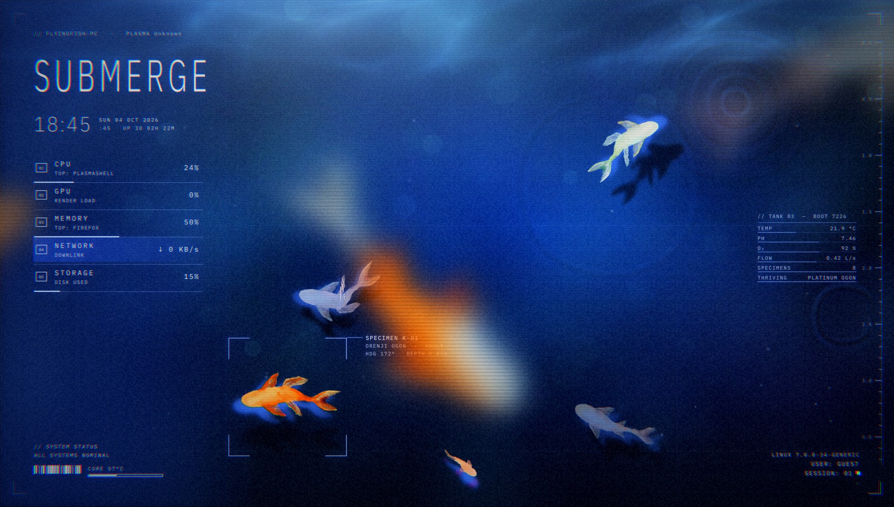

# Submerge

A late night koi pond for KDE Plasma 6, styled like an old game loading screen.



- **Live wallpaper**: koi that swim in bursts and glides and bend into their turns, real
  ripples from a small water simulation, caustic light along the top, and two or three big
  blurry glitching koi drifting past the glass.
- **HUD**: big clock, live CPU / GPU / memory / network / storage readouts (with the app using
  the most CPU and memory), and a system status line.
- **Tank monitor**: one specimen box that locks onto the fish nearest your cursor, a depth
  ruler, and tank conditions that are rerolled every boot. Warm water brings out the orange
  varieties, acidic water the teal ones, alkaline water the violet ones, low oxygen more juveniles.
- **Plasma style** for the panel and task manager, a **colour scheme**, and a **splash screen**.

## Install

Grab `submerge-1.0.tar.gz` from [Releases](../../releases), then:

```sh
tar xzf submerge-1.0.tar.gz
cd submerge-1.0
./install.sh --apply
```

Without `--apply` it only installs; pick **Submerge** under System Settings > Colours & Themes >
Global Theme. `./uninstall.sh` removes it. Needs Plasma 6.

## From source

```sh
./install.sh        # recompiles shaders (needs uv) and installs the wallpaper
./preview.py        # live preview window that restarts whenever a file changes
./build-dist.sh     # builds dist/submerge-<version>.tar.gz and the KDE Store archives
```

`prep.py` regenerates the tinted fish and water images from the original art, and
`plasma-style/build.py` builds the panel style.

## License

Code is GPL-3.0-or-later (`LICENSE`). The fish, water and caustic artwork is by MossyFish,
from [Still Waters](https://github.com/MossyFish/Still-Waters), and is CC BY-NC-SA 4.0
(`ART-LICENSE.md`). The bundled IBM Plex fonts are under the SIL Open Font License.
