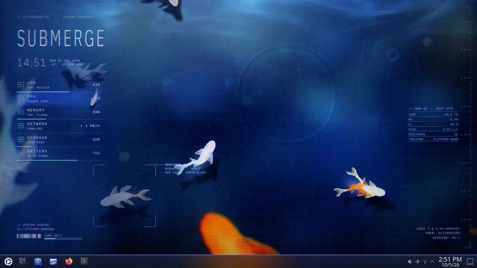

# Submerge

A deep ocean koi fish theme for KDE Plasma 5 and 6. The wallpaper is animated and has a HUD
for the clock and system stats, and it comes with a matching panel style, colour scheme and
splash screen.




Videos: [the wallpaper](store/demo/submerge-wallpaper.mp4) and [the whole theme](store/demo/submerge-global-theme.mp4).

## What's in it

- Koi that swim in short bursts and glides. The ripples come from a small water sim, so drips
  and fish coming up to the surface leave rings.
- A HUD with the time, CPU, GPU, memory, network, disk and battery (with time left), plus
  which app is using the most CPU and memory.
- Hover over a fish to put the specimen box on it. It shows the variety, heading and depth.
- Tank temperature, pH and oxygen get rerolled every boot and change which koi show up.
- It's easy on battery. It runs at 20 fps, drops to 10 while you're in a window, stops when a
  maximized window covers it, and holds still on battery while you're using a window.

## Install

From the KDE Store: [global theme](https://store.kde.org/p/2377260/),
[wallpaper](https://store.kde.org/p/2377252/), [panel style](https://store.kde.org/p/2377258/),
[colour scheme](https://store.kde.org/p/2377259/). Or grab `submerge-1.7.tar.gz` from [Releases](../../releases), then:

```sh
tar xzf submerge-1.7.tar.gz
cd submerge-1.7
./install.sh --apply
```

Without `--apply` it only installs; pick **Submerge** under System Settings > Colours & Themes >
Global Theme. `./uninstall.sh` removes it. Needs Plasma 6.

## From source

```sh
./install.sh        # recompiles shaders (needs uv) and installs the wallpaper
./preview.py        # live preview window that restarts whenever a file changes
./build-dist.sh     # builds dist/submerge-<version>.tar.gz and the KDE Store archives
```

`prep.py` regenerates the tinted fish and water images from the original art, and
`plasma-style/build.py` builds the panel style.

## Lock screen and sign-in screen

The wallpaper works on the lock screen too. Pick **Submerge** under System Settings >
Screen Locking > Appearance, or run:

```sh
kwriteconfig6 --file kscreenlockerrc --group Greeter --key WallpaperPlugin org.submerge.wallpaper
kwriteconfig6 --file kscreenlockerrc --group Greeter --group Wallpaper --group org.submerge.wallpaper --group General --key LockScreen true
kwriteconfig6 --file kscreenlockerrc --group Greeter --group LnF --group General --key hideClockWhenIdle true
```

On the lock screen the HUD moves to a centred layout with its own clock. The last line makes
Plasma's clock show up only while you're typing your password, when the pond behind it is
blurred, so the time never shows twice (same as Screen Locking > Configure > Show clock: On
unlocking prompt).

For the sign-in screen (SDDM), the release has an `sddm` folder with Breeze's login form over
the pond. It installs system-wide, so it needs sudo:

```sh
cd submerge-1.7/sddm
sudo ./install.sh            # undo with: sudo ./install.sh --remove
```

## Plasma 5

[darshg321](https://github.com/darshg321) ported Submerge to Plasma 5.27 on the
[`plasma5` branch](../../tree/plasma5), and came up with the frame rate cap, multi-step ripples,
battery readout and lock / sign-in screens that this version now uses too.

## License

Code is GPL-3.0-or-later (`LICENSE`). The fish, water and caustic artwork is by flyingf15h,
from [Still Waters](https://github.com/MossyFish/Still-Waters), and is CC BY-NC-SA 4.0
(`ART-LICENSE.md`). The bundled IBM Plex fonts are under the SIL Open Font License.
